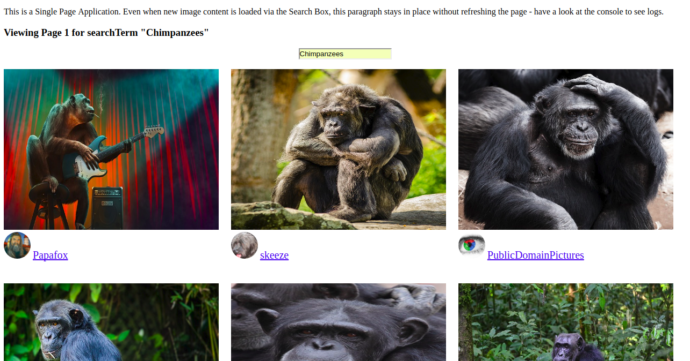
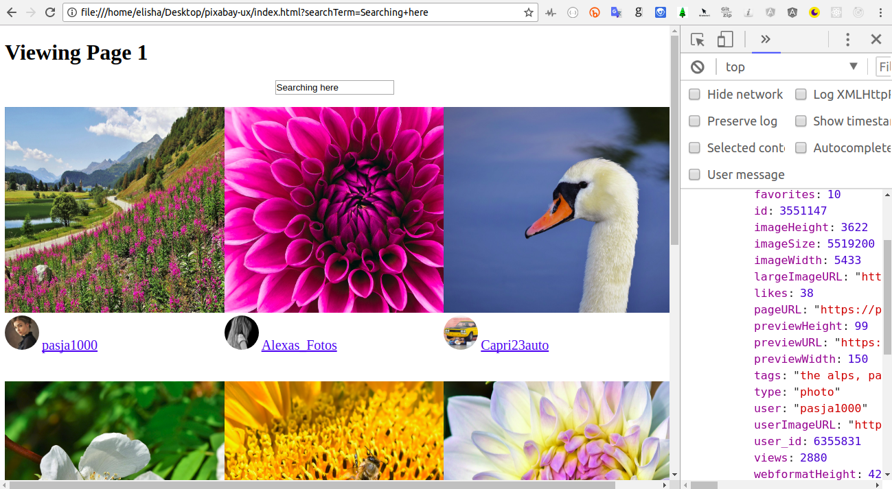

Earlier stage of Development (before search feature) - here's the object we're getting back from the Pixabay API:




<h2>2 versions</h2>

<h3>V1: Without Webpack</h3>

In this version, all of our app's logic is within the app.js file.


<h3>V2: With Webpack (and ES6 Modules)</h3>

Instructions for running this version:

Step 1: Clone the repo and CD into the 'V2' folder.

Step 2: Run 'npm install'

Step 3: Run 'npm start'

Step 4: Open your browser and open your 'index.html' file. Voila - your page will be loaded. At this point, Webpack will be listening for changes. So, go ahead and change your JS files as much as you'd like. Simply reload the page (no need to stop and start your webpack server for changes to take effect).


```

Implemented ES6 modules based on this blog post:

https://medium.com/@svinkle/getting-started-with-webpack-and-es6-modules-c465d053d988


Notes about Forms:

https://javascript.info/forms-submit

https://developer.mozilla.org/en-US/docs/Web/API/HTMLFormElement/elements
```

